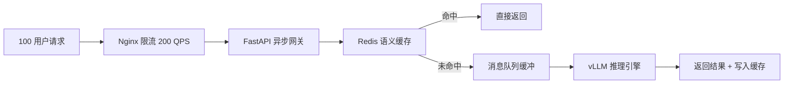

# AI Infra要求（100 人并发 RAG 问答）

### 硬件配置（最低配置）

| 组件 |  推荐配置 |
|------|----------|
| GPU | RTX 3090 24GB | 
| CPU | 16 核 |
| 内存 | 32 GB |
| 存储 | 500GB NVMe SSD |
| 网络 | 千兆网卡 |

---

### 并发策略

- **vLLM 连续批处理**：将多个请求合并为一个 batch，GPU 利用率 > 80%
- **语义缓存**：相似问题复用结果，降低 LLM 调用量 30%~50%
- **队列削峰**：瞬时 100 并发 → 平滑消费，保障服务稳定性
- **预估吞吐**：7B 模型 ~50 token/s/用户，14B 模型 ~30 token/s/用户

---

### 显存分配估算（2× RTX 4090 48GB 总显存）

| 模型 | 显存占用 | 部署位置 |
|------|----------|----------|
| Qwen2.5-14B-INT4 | ~8 GB | GPU 0 |
| BGE-M3（Embedding） | ~2 GB | GPU 1 |
| BGE-Reranker-v2-m3 | ~2 GB | GPU 1 |
| KV Cache + 批处理预留 | ~16 GB | GPU 0 |
| 系统预留 | ~4 GB | 各卡 |
| **合计** | **~32 GB / 48 GB** | 余量充足 |