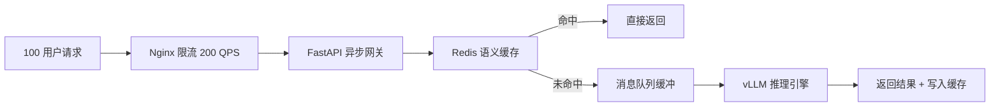

02_构建RAG系统

### 并发策略

```mermaid
graph LR
    A[100 用户请求] --> B[Nginx 限流 200 QPS]
    B --> C[FastAPI 异步网关]
    C --> D[Redis 语义缓存]
    D -->|命中| E[直接返回]
    D -->|未命中| F[消息队列缓冲]
    F --> G[vLLM 推理引擎]
    G --> H[返回结果 + 写入缓存]
```

- **vLLM 连续批处理**：将多个请求合并为一个 batch，GPU 利用率 > 80%
- **语义缓存**：相似问题复用结果，降低 LLM 调用量 30%~50%
- **队列削峰**：瞬时 100 并发 → 平滑消费，保障服务稳定性
- **预估吞吐**：~30 token/s/用户
