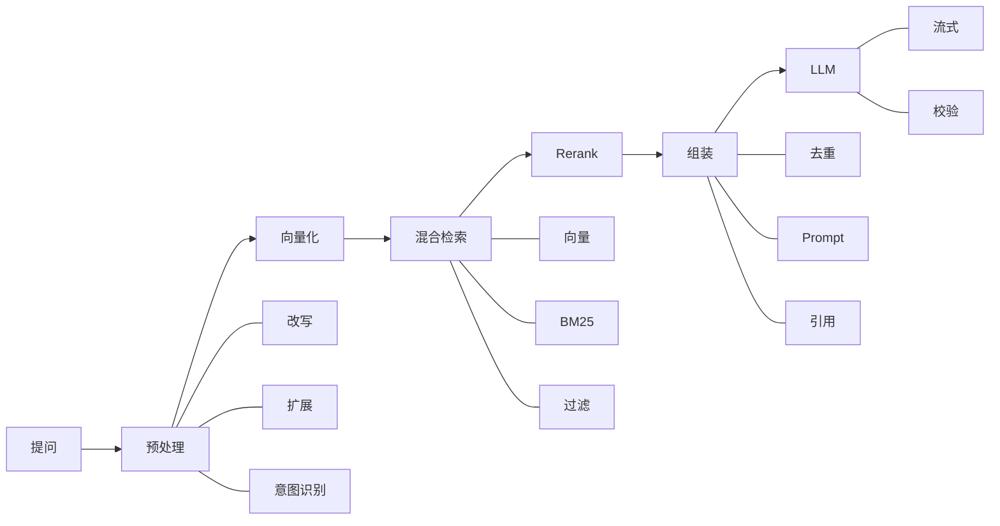

02_构建RAG系统

### 检索工作流

```mermaid {scale: 0.65}
flowchart LR
    A[提问] --> B[预处理] --> C[向量化] --> D[混合检索] --> E[Rerank] --> F[组装] --> G[LLM]
    B --- B1[改写] & B2[扩展] & B3[意图识别]
    D --- D1[向量] & D2[BM25] & D3[过滤]
    F --- F1[去重] & F2[Prompt] & F3[引用]
    G --- G1[流式] & G2[校验]
```