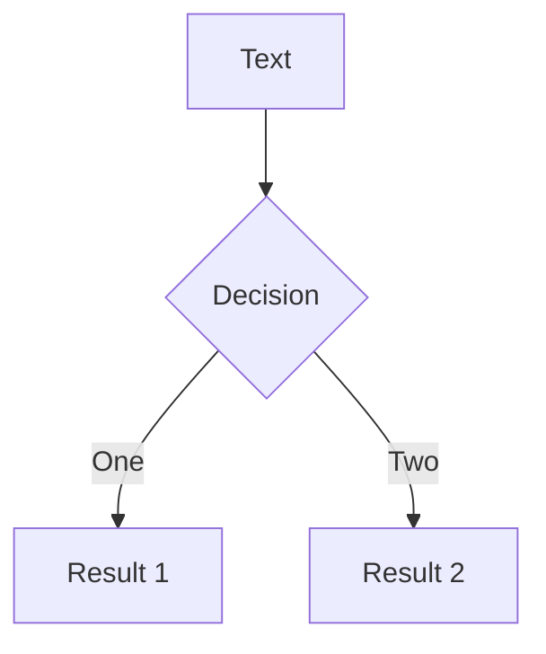

# new

## 组件
<!-- ./components/Counter.vue -->
<Counter :count="10" m="t-4" />

 red box are used to signify strings.

 yellow highlight  red highlight 

<v-click>
show
</v-click>
<v-click>
show1
</v-click>
<v-click>
show2
</v-click>

## 流程图

::right::
