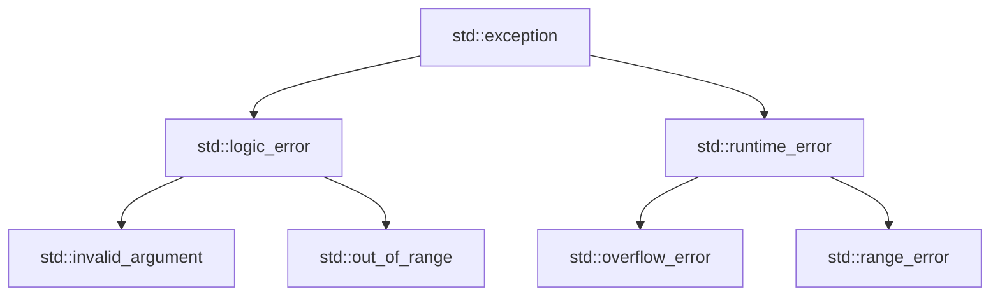

# 异常处理

## try / catch 结构

```cpp
#include <stdexcept>

try {
    int num;
    std::cin >> num;

    if (num == 0) {
        throw std::runtime_error("不能为零");
    }
    int result = 100 / num;
    std::cout << "100/" << num << " = " << result;

} catch (const std::runtime_error& e) {
    std::cerr << "运行时错误: " << e.what() << "\n";

} catch (const std::exception& e) {
    std::cerr << "异常: " << e.what() << "\n";

} catch (...) {
    std::cerr << "未知异常\n";
}
```

::right::

## 异常层次结构



## 常用标准异常

| 异常类 | 触发场景 |
|--------|----------|
| `std::runtime_error` | 运行时错误 |
| `std::logic_error` | 逻辑错误 |
| `std::out_of_range` | 访问越界 |
| `std::invalid_argument` | 参数无效 |
| `std::bad_alloc` | 内存分配失败 |

## RAII 与异常安全

```cpp
class FileGuard {
    std::ofstream file;
public:
    FileGuard(const std::string& path)
        : file(path) {}
    ~FileGuard() { file.close(); }
    // 即使抛异常，析构函数也会执行
};
```

<div class="mt-2 p-3 bg-rose-500/10 rounded-lg text-sm">
🔒 C++ 的 <b>RAII</b>（资源获取即初始化）机制确保异常时资源也能正确释放。推荐用 <b>智能指针</b> 管理资源。
</div>