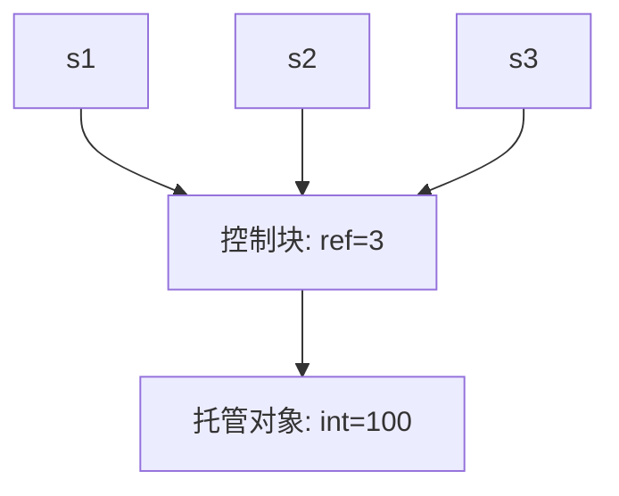
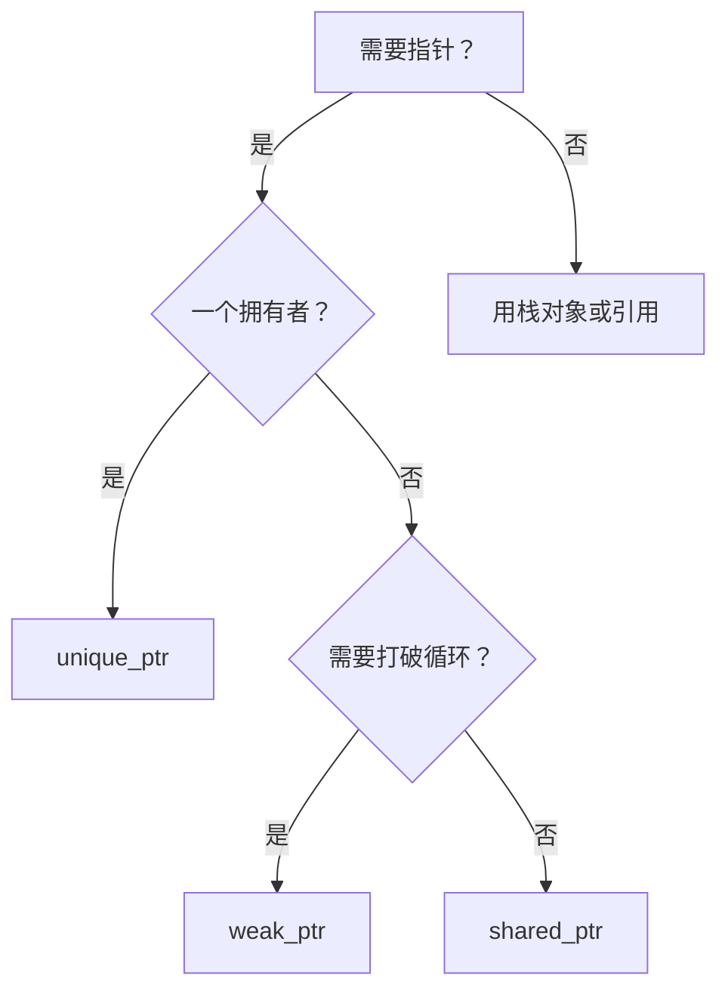

# 进阶：智能指针

## 为什么需要智能指针？

裸指针（raw pointer）的问题：
- 忘记 `delete` → **内存泄漏**
- 过早 `delete` → **悬垂指针**（use-after-free）
- 异常抛出时无法执行 `delete` → **泄漏**

智能指针：**自动管理内存**，离开作用域自动释放。

```cpp
#include <memory>

// ❌ 裸指针：需要手动 delete
int* p = new int{42};
// ... 如果这里抛异常，就不会执行下面的 delete
delete p;

// ✅ 智能指针：自动释放
auto p = std::make_unique<int>(42);
// 出作用域自动释放，异常安全！
```

## 三种智能指针

| 类型 | 所有权 | 用途 |
|------|--------|------|
| `unique_ptr` | 独占 | 唯一拥有者 |
| `shared_ptr` | 共享 | 多个拥有者，引用计数 |
| `weak_ptr` | 弱引用 | 不增加引用计数，打破循环引用 |

::right::

## std::unique_ptr — 独占所有权

```cpp
#include <memory>

// 创建（推荐 make_unique）
auto p1 = std::make_unique<int>(42);
auto p2 = std::make_unique<std::string>("Hello");

// 不可复制，只能移动
auto p3 = std::move(p1);   // 所有权转移
// p1 现在为 nullptr

// 自定义删除器
auto file = std::unique_ptr<FILE, decltype(&fclose)>{
    fopen("test.txt", "r"), fclose
};

// 转换为裸指针（不转移所有权）
int* raw = p3.get();
```

## 使用场景对比

```cpp
// unique_ptr：独占，适合工厂函数
std::unique_ptr<Animal> create_animal() {
    return std::make_unique<Dog>();
}
auto pet = create_animal();

// 函数参数传递
void process(std::unique_ptr<Data> data);  // 转移所有权
void use(const std::unique_ptr<Data>& d);  // 借用
void inspect(Data* data);                  // 裸指针（不涉及所有权）
```

---

## std::shared_ptr — 共享所有权

```cpp
auto s1 = std::make_shared<int>(100);
auto s2 = s1;        // 引用计数 = 2
auto s3 = s2;        // 引用计数 = 3

s3.reset();          // s3 释放，计数 = 2
std::cout << s1.use_count(); // 2

// 当最后一个 shared_ptr 销毁时，释放内存
```

## 引用计数原理



## std::weak_ptr — 弱引用

```cpp
auto shared = std::make_shared<int>(42);
std::weak_ptr<int> weak = shared;

// 使用前必须 lock() 检查是否有效
if (auto sp = weak.lock()) {
    std::cout << *sp;  // 安全访问
} else {
    std::cout << "已释放";
}

shared.reset();         // 释放
// weak.lock() 现在返回 nullptr
```

## 打破循环引用

```cpp
class B;
class A {
    std::shared_ptr<B> ptr_b;    // shared
};
class B {
    std::weak_ptr<A> ptr_a;      // weak ← 关键！
};
// A 和 B 相互引用不会泄漏
```

## 选择指南



<div class="mt-2 p-3 bg-emerald-500/10 rounded-lg text-sm">
🔑 默认用 <b>unique_ptr</b>，只在确实需要共享时用 shared_ptr。智能指针 = <b>零成本抽象</b>。
</div>