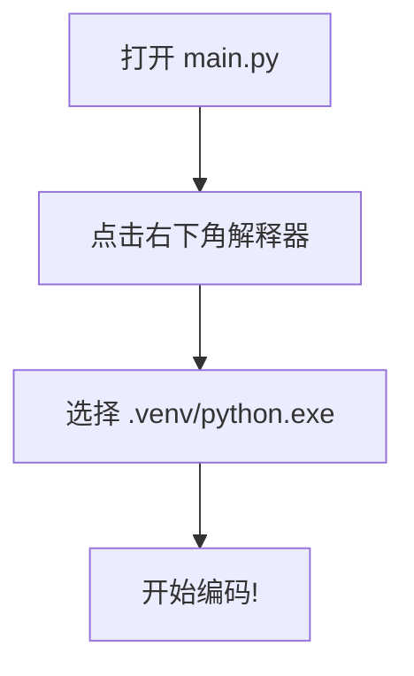

<div class="text-3xl font-bold mb-6">📦 环境准备：uv 与项目创建</div>

<div class="mt-8">
<h3 class="text-xl font-semibold mb-4">📥 安装 uv</h3>

现代 Python 包管理器，替代 pip：

```bash
winget install --id=astral-sh.uv -e
```

验证安装：

```bash
uv --version
```
</div>

<div class="mt-10">
<h3 class="text-xl font-semibold mb-4">🚀 创建项目</h3>

```bash
# 1. 新建文件夹并用 VSCode 打开
# 2. 终端中初始化项目
uv init

# 3. 同步依赖（下载 Python + 依赖）
uv sync
```
</div>

::right::

<div class="mt-4">
<h3 class="text-xl font-semibold mb-6">⚙️ 配置解释器</h3>


</div>

<div class="mt-10">
<h3 class="text-xl font-semibold mb-4">🐛 调试代码</h3>

- 行号左侧点击 → 设置**断点**（红点）
- 按 `F5` → 启动调试
- 程序在断点处暂停，可查看变量
</div>

<div class="mt-8 p-5 bg-green-500/10 border-l-4 border-green-500 rounded-lg">
✅ uv 自动管理虚拟环境和依赖，无需手动配置。
</div>