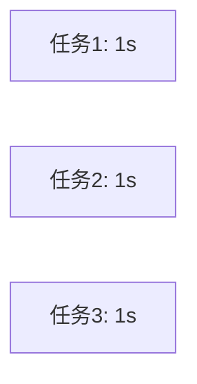

# 异步编程：asyncio

## 为什么需要异步？

同步执行（串行）：

总耗时：**3秒**

异步执行（并发）：

总耗时：**约1秒**

::right::

## 代码示例

```python
import asyncio

async def cook(dish: str, time: int):
    await asyncio.sleep(time)
    print(f"{dish} 完成！")

async def main():
    await asyncio.gather(
        cook("鱼香肉丝", 1),
        cook("红烧肉", 1),
        cook("青椒肉丝", 1),
    )

asyncio.run(main())
```

## 关键概念

| 关键字 | 作用 |
|--------|------|
| `async def` | 定义协程函数 |
| `await` | 等待协程完成 |
| `asyncio.gather()` | 并发执行多个协程 |
| `asyncio.run()` | 运行顶层协程 |

<div class="mt-4 p-4 bg-pink-500/10 rounded-lg">
⚡ 异步编程适合 IO 密集型任务（网络请求、文件读写），能大幅提升性能。
</div>