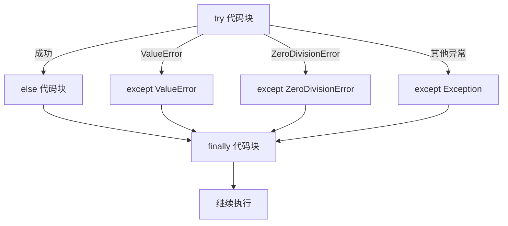

# 异常处理

## try / except 结构

```python
try:
    num = int(input("输入数字: "))
    result = 100 / num
    print(f"100/{num} = {result}")

except ValueError:
    print("请输入有效数字！")

except ZeroDivisionError:
    print("不能除以零！")

except Exception as e:
    print(f"未知错误: {e}")

else:
    print("计算成功！")

finally:
    print("处理结束")
```

::right::

## 执行流程



## 常见异常类型

| 异常 | 触发条件 |
|------|----------|
| `ValueError` | 类型转换失败 |
| `ZeroDivisionError` | 除以零 |
| `TypeError` | 类型不匹配 |
| `KeyError` | 字典键不存在 |
| `IndexError` | 列表索引越界 |
| `FileNotFoundError` | 文件不存在 |
