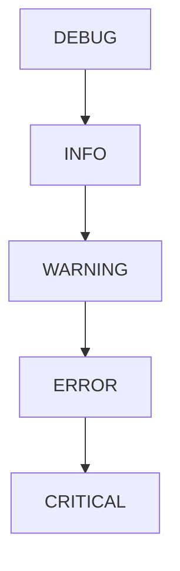

# 进阶：logging 日志模块

## 为什么用 logging？

`print()` 的局限性：
- 无法区分日志级别
- 无法控制输出格式
- 无法输出到文件

## 基本配置

```python
import logging

logging.basicConfig(
    level=logging.INFO,
    format='%(asctime)s - %(levelname)s - %(message)s'
)
```

::right::

## 五个日志级别

```python
logging.debug("调试信息")     # 不输出
logging.info("一般信息")      # ✅ 输出
logging.warning("警告信息")   # ✅ 输出
logging.error("错误信息")     # ✅ 输出
logging.critical("严重错误")  # ✅ 输出
```

## 级别层级



设置 `level=INFO` 后，只输出 INFO 及以上级别。

<div class="mt-4 p-4 bg-cyan-500/10 rounded-lg">
📋 生产环境中务必使用 logging 替代 print，便于问题排查和监控。
</div>