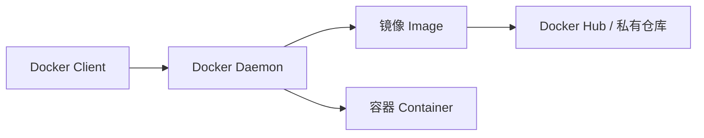

<div class="text-3xl font-bold mb-6">🐳 Docker 安装与配置</div>

<div class="mt-8">
<h3 class="text-xl font-semibold mb-4">📥 安装配置 Docker</h3>

```bash
# 一键安装
curl -fsSL https://get.docker.com | bash
# 国内网络安装，推荐使用阿里云镜像
curl -fsSL https://get.docker.com | bash -s docker --mirror Aliyun
```

👤 添加用户到 docker 组,避免每次使用 `sudo`：

```bash
sudo usermod -aG docker $USER
# 重新登录或执行以下命令生效
newgrp docker
```

✅ 验证安装

```bash
docker --version
# Docker version 27.x.x

docker run hello-world
# Hello from Docker!
```
</div>

::right::

<div class="mt-4">
<h3 class="text-xl font-semibold mb-6">⚙️ 配置 Docker 开机自启</h3>

```bash
# WSL2 中 Docker 服务不会自动启动
# 添加到 ~/.bashrc 实现自动启动
echo 'sudo service docker start 2>/dev/null' >> ~/.bashrc
```

<h3 class="text-xl font-semibold mb-4 mt-10">🔧 一行脚本配置国内镜像加速</h3>

```bash
sudo mkdir -p /etc/docker && echo '{"registry-mirrors": ["https://docker.1ms.run", "https://docker.xuanyuan.me"]}' | sudo tee /etc/docker/daemon.json > /dev/null && sudo systemctl restart docker
```

<h3 class="text-xl font-semibold mb-4 mt-10">📋 Docker 架构</h3>


</div>

<div class="mt-6 p-5 bg-cyan-500/10 border-l-4 border-cyan-500 rounded-lg">
🐳 Docker 是容器化标准工具，一次构建，到处运行。
</div>