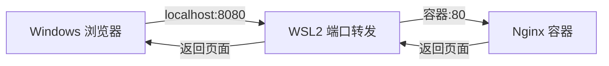

<div class="text-3xl font-bold mb-6">🌐 Docker 部署 Nginx</div>

<div class="mt-8">
<h3 class="text-xl font-semibold mb-4">🚀 快速启动 Nginx</h3>

```bash
# 拉取并运行 Nginx
docker run -d \
  --name my-nginx \
  -p 8080:80 \
  nginx:latest
```

参数说明：

| 参数 | 含义 |
|------|------|
| `-d` | 后台运行 |
| `--name` | 容器名称 |
| `-p 8080:80` | 端口映射（主机:容器） |
</div>

<div class="mt-10">
<h3 class="text-xl font-semibold mb-4">✅ 验证服务</h3>

```bash
# 在 WSL2 中访问
curl http://localhost:8080

# 在 Windows 浏览器中访问
# http://localhost:8080
```

看到 "Welcome to nginx!" 即成功！
</div>

::right::

<div class="mt-4">
<h3 class="text-xl font-semibold mb-6">📁 挂载自定义页面</h3>

```bash
# 创建网站目录
mkdir -p ~/nginx-site

# 创建首页
echo '<h1>Hello from WSL2 + Docker!</h1>' \
  > ~/nginx-site/index.html

# 挂载目录运行
docker run -d \
  --name my-site \
  -p 8081:80 \
  -v ~/nginx-site:/usr/share/nginx/html:ro \
  nginx:latest
```

<h3 class="text-xl font-semibold mb-4 mt-8">🔗 端口映射原理</h3>


</div>

<div class="mt-6 p-5 bg-orange-500/10 border-l-4 border-orange-500 rounded-lg">
🌍 Nginx 是高性能的 HTTP 服务器和反向代理，静态资源处理能力极强。
</div>